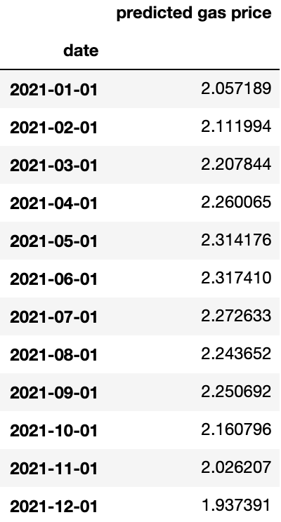

# Gas Prices:
## Will They Stay or Will They Go...Up or Down

by Jacob Ash and Zachary Greenberg

# Overview
Gas Prices have a history of change over time. This project aims to be one step ahead and accurately capture these changes for a calendar year. Being able to see this information can help people make informed decisions on their future financial planning. Our results were determined through the utilization of data from the EIA Open Data API as well as various additional sources. 

# Business Problem
Gas prices directly affect drivers everywhere. The rise of gas prices will financially impact their decisions and budgetary allowances, possibly restricting travel opportunities. With the ability to estimate future pricing, this could give individuals as well as transportation companies information so that they can plan ahead and account for any rise or decline.

# Data
Our data was taken from a combination of resources including the EIA Open Data API, Federal Reserve Economic Data, and Matteo Iacovello's Geopolitical Risk Index dataset. We have compiled our dataset from these resources, searching for the history of gas prices over time as well as other factors that are thought to influence the prices themselves. Here is a compiled list of the variables:

**Target**: RETAIL_GAS_PRICE - All Grades of Gasoline, U.S. City Average Retail Price, Monthly (Dollars per Gallon with Taxes  

REGULAR_GAS_PRICE - U.S. Regular All Formulations Retail Gasoline Prices, Monthly (Dollars per Gallon)  
PREMIUM_GAS_PRICE - U.S. Premium All Formulations Retail Gasoline Prices, Monthly (Dollars per Gallon)  
EUROPE_BRENT - Europe Brent Spot Price FOB, Monthly (Dollars per Barrel)  
WTI - Cushing, OK WTI Spot Price FOB, Monthly (Dollars per Barrel)  
OIL_SUPPLY - U.S. Supply Adjustment of Crude Oil and Petroleum Products, Monthly (Thousands Barrels)  
CRUDE_OIL_PRODUCTION - Crude Oil Production, 48 States, Monthly (Thousands Barrels per Day)  
EMPLOYEES_OIL_EXTRACTION - Employees in US Oil, Monthly (Thousands of Persons)  
IMPORTS - Petroleum Imports, Annually (Millions of Barrels Per Day)  
FEDERAL_GAS_TAX - Excise Taxes on Gasoline, Annually (Billions of Dollars)  
STATE_GAS_TAX - State Government Sales Tax on Gasoline, Annually (Billions of Dollars)  
INFLATION - Inflation in Consumer Prices, Annually (Percent)  
GPR_MEXICO:GPR:COLOMBIA - Geopolitical Risk Index, Monthly, (Scale 0 to 600)  

__IMPORTANT NOTE:__
If you would like to pull the data yourself using the data collection notebook, you must first request an API key from the <a href = "https://www.eia.gov/opendata/register.php">EIA website</a>. Then create a api_key.py file in the data folder, and create a variable called "api_key". Finally, save that API key to that variable as a string. This allows our notebook to properly run.

# EDA
We started by taking a look at the distribution of the target variable:

Through research we were able to determine the causes of some of the dips in the prices. These events include the recession of 2008, as well as the fall of gas prices due to Saudi Arabia's overproduction of oil in 2014.

Additionally we examined the exogenous variables as we imagined they would help us to understand the trends in gas prices and allow us to formulate predictions:

We saw that the benchmark prices of Europe Brent and West Texas Intermediate Crude Oil follow tightly with the average US gas prices.

# Model Selection

We ran 5 time series models: Arima, Seasonal Arima, Facebook Prophet, Arima with Exogenous variables, and Seasonal Arima with Exogenous variables. These models all predicted 2020 gas prices, and we then calculated the RMSE of these predictions to find the best model.

Here we can see that our Facebook Prophet model had the lowest RMSE, so this is what we used for our future predictions.

# Predictions

 

 
We then create and deploy our final model to predict 2021 gas prices nationally. We can see that December has the lowest average price point, and the highest is June. 

# Next steps
To expand our project, we next want to create a Facebook Prophet model that includes our exogenous data. We believe that including this extra information, it will allow for an even lower RMSE. Secondly, we would like to create a more inferential model on our data which would allow us to obtain a better understanding as to why they influence retail gas price the way they do. Finally, we would like to collect data on a smaller scale, like statewide or regional. This will allow for more accurate prices for those areas.
